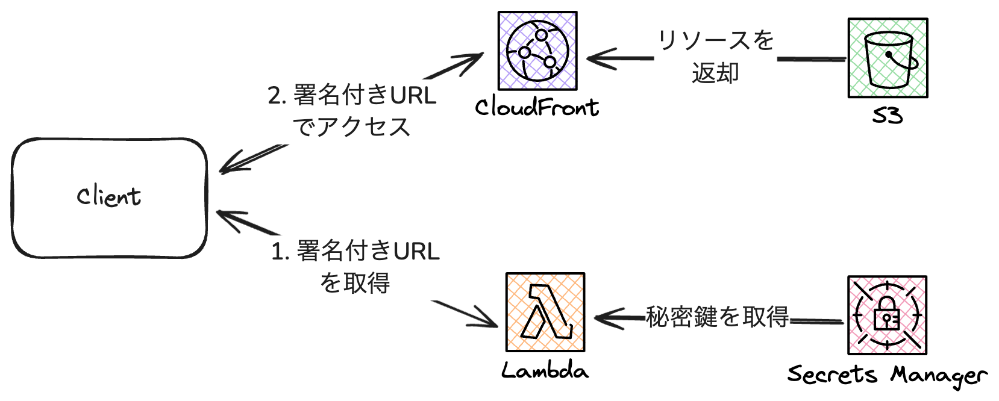

# CloudFront Signed URL Sample
CloudFront の署名付きURLを使用して、S3 のファイルを配信する実装サンプルです。



The `cdk.json` file tells the CDK Toolkit how to execute your app.

## Useful commands

* `pnpm run build`   compile typescript to js
* `pnpm run watch`   watch for changes and compile
* `pnpm run test`    perform the jest unit tests
* `npx cdk deploy`  deploy this stack to your default AWS account/region
* `npx cdk diff`    compare deployed stack with current state
* `npx cdk synth`   emits the synthesized CloudFormation template


## Deploy

```bash
pnpm cdk:dev deploy --all
```

## cdk.json の設定
- `awsAccountId`
  - デプロイ先の AWS アカウントID
- `hostName`
  - Web サイトのホスト名。A レコードは CDK によって作成されるため、事前の作成は不要。
- `domainName`
  - 事前に作成したパブリックホストゾーンのドメイン名
- `hostedZoneId`
  - domainName のホストゾーンID
- `s3OriginAccessControlId`
  - S3 用の OAC ID

## BucketListViewerStack
署名付きURLを生成する簡易 API。
